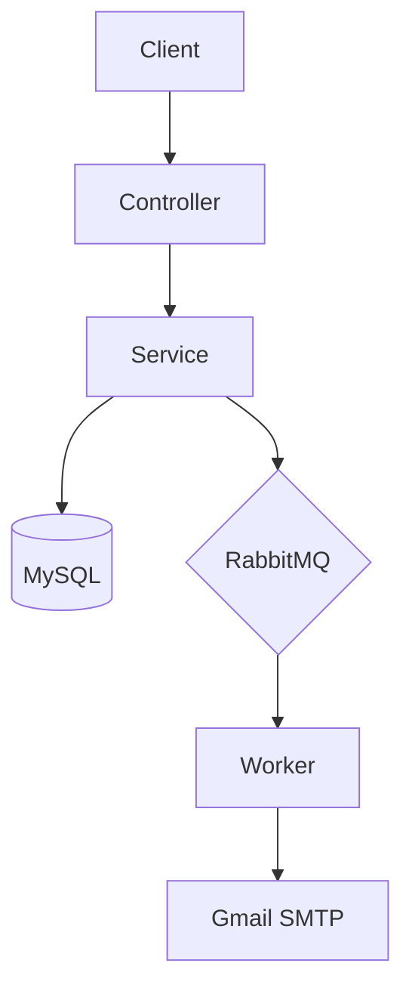
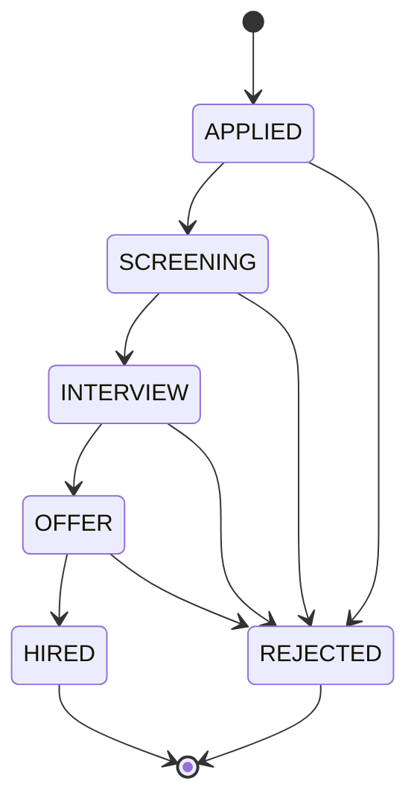
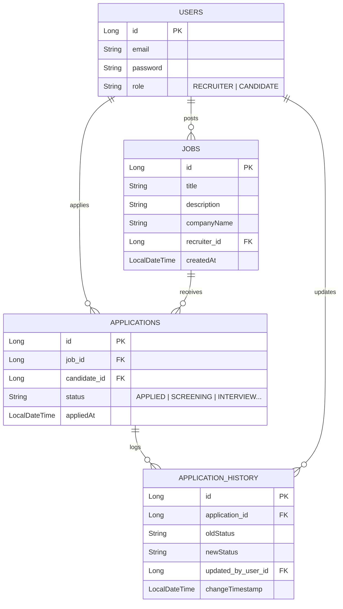

# 🎯 HireFlow ATS (Job Application Tracking System)

A robust, enterprise-grade backend for a Job Application Tracking System (ATS). This system manages the complete recruitment lifecycle using **Role-Based Access Control (RBAC)**, a strict **Workflow State Machine**, and **Asynchronous Email Notifications** via RabbitMQ.

## 🏗️ Architecture Overview

The system follows a **Layered Architecture** and uses an event-driven notification worker.

### System Components
1. **Main API (Spring Boot)** – Handles routes, logic, and security  
2. **MySQL Database** – Stores relational job data  
3. **RabbitMQ** – Message broker for async events  
4. **Notification Worker** – Sends email alerts using Gmail SMTP  

### Async Notification Flow

1. Save application to MySQL  
2. Build `NotificationMessage` DTO  
3. Publish to RabbitMQ (`email_queue`)  
4. API returns immediately  
5. Worker consumes and sends the email  



## 🔄 Application Workflow (State Machine)

### Workflow Diagram



## 🗄️ Database Schema

The following Entity-Relationship Diagram (ERD) illustrates the database structure and relationships.



## 🔐 RBAC Matrix (Security)

### Role Permissions Table

| Action | Endpoint | Method | Recruiter | Candidate | Public |
|--------|----------|--------|-----------|-----------|---------|
| Register | `/auth/register` | POST | ✅ | ✅ | ✅ |
| Login/Auth | (Basic Auth) | POST | ✅ | ✅ | ✅ |
| View All Jobs | `/jobs` | GET | ✅ | ✅ | ✅ |
| Post a Job | `/jobs` | POST | ✅ | ❌ | ❌ |
| Apply for Job | `/applications/{jobId}` | POST | ❌ | ✅ | ❌ |
| Update Status | `/applications/{id}/status` | PATCH | ✅ | ❌ | ❌ |
| View History | `/applications/{id}/history` | GET | ✅ | ❌ | ❌ |
| My Applications | `/applications/my-applications` | GET | ❌ | ✅ | ❌ |

## ⚙️ Setup & Installation Instructions

### 1. Prerequisites

- Java 21+  
- Docker Desktop (for RabbitMQ)  
- MySQL server  
- Maven wrapper  


### 2. Start RabbitMQ

```bash
docker run -d --hostname rabbitmq-host --name ats-rabbitmq -p 5672:5672 -p 15672:15672 rabbitmq:3-management
```

### 3. Configure Credentials
Set your local credentials in your terminal before running the app.

> **📧 Gmail Setup Note:** > Do not use your regular Gmail login password. You must generate a secure **App Password**:
> 1. Go to [Google Account Security](https://myaccount.google.com/security).
> 2. Enable **2-Step Verification** (if not already on).
> 3. Search for **"App passwords"**.
> 4. Create a new app (name it "ATS") and copy the 16-character code. Use this code as your `MAIL_PASSWORD`.


### 4. Configure Environment Variables

#### PowerShell (Windows)

```powershell
$env:DB_USERNAME="root"
$env:DB_PASSWORD="YOUR_MYSQL_PASSWORD"
$env:MAIL_USERNAME="your.email@gmail.com"
$env:MAIL_PASSWORD="your-google-app-password"
```

#### Bash (macOS/Linux)

```bash
export DB_USERNAME="root"
export DB_PASSWORD="YOUR_MYSQL_PASSWORD"
export MAIL_USERNAME="your.email@gmail.com"
export MAIL_PASSWORD="your-google-app-password"
```

### 5. Run the Application

```bash
./mvnw spring-boot:run
```

### Postman Testing Flow
- Register Recruiter  
- Login with Basic Auth  
- Create Job  
- Register Candidate  
- Apply for Job  
- Check Email Notification